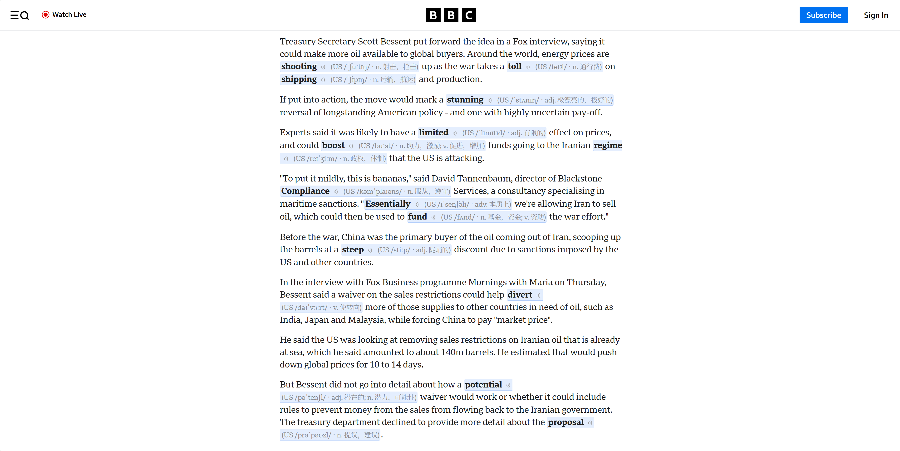
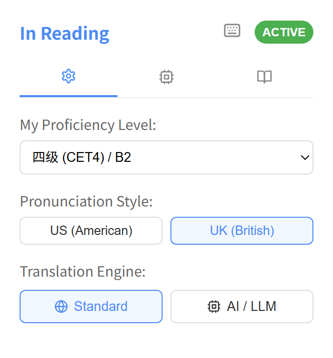
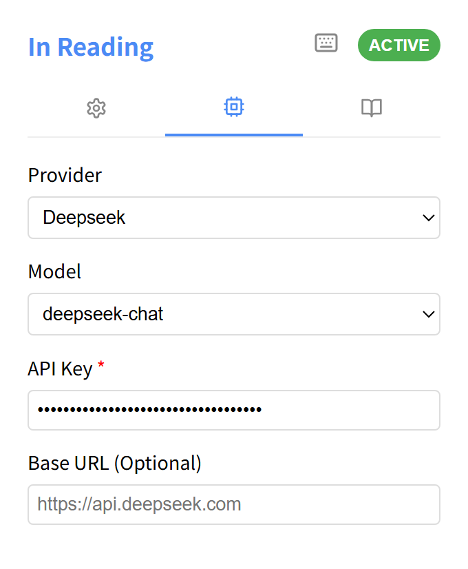
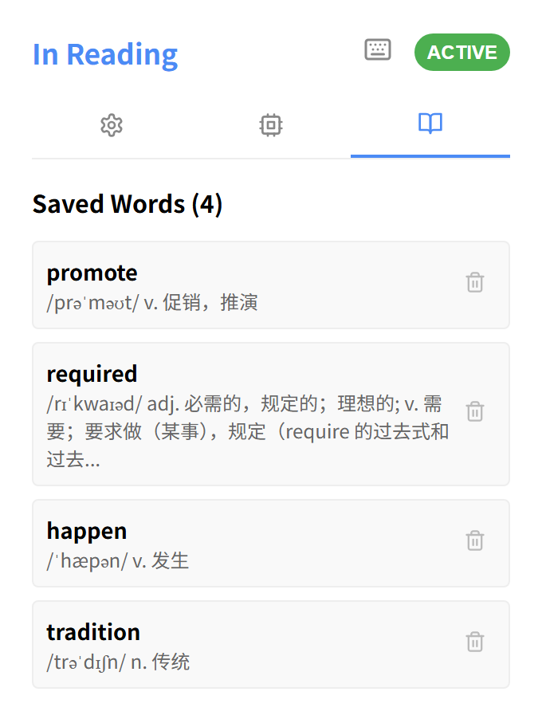
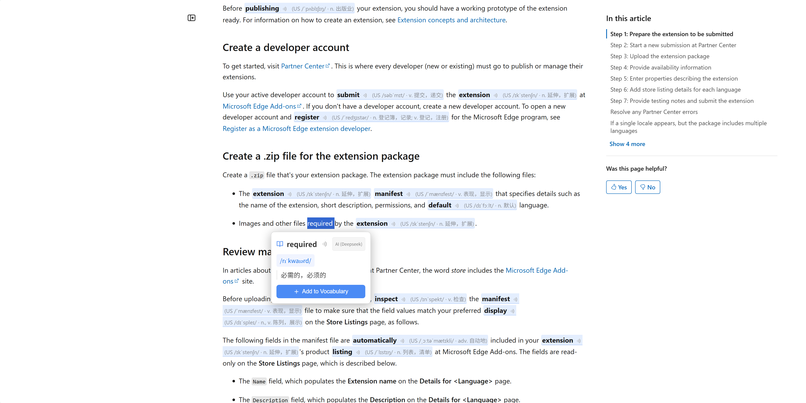

# In Reading - 进入沉浸式外语习得境界

> **"The best way to learn a language is to get lost in its stories."**  
> **In Reading** 是一款重新定义“阅读辅助”的浏览器插件。它的存在不是为了替你翻译，而是为了清除你在原生阅读路径上的最后一块绊脚石，让你真正进入“沉浸式阅读”的心流状态。

---

## 🧭 我们的哲学：为什么叫 In Reading？

在阅读外语网页时，我们往往在两个错误的方向上徘徊：
1. **Out of Reading (跳出阅读)**：遇到生词，复制、切换标签页、查词、再切回。每一次查词都在割裂你的思维，让你疲于奔命。
2. **Beyond Reading (过度翻译)**：一键全量翻译。你虽然看懂了意思，但你的眼睛避开了原文。你是在“看中文”，而不是在“读外语”。

**In Reading 的目标是让你始终保持在阅读之中 (Stay *In* Reading)。** 我们通过智能分级过滤和原位语境注解，实现克拉申（Stephen Krashen）的 **i + 1** 习得理论——让你在读懂 90% 内容的舒适区里，通过那 10% 的精准辅助，实现词汇量的无痛增长。

---

## ✨ 核心特色

### 1. 真正的“沉浸式”无感辅助
注解直接浮现在生词上方，自带 **IPA 国际音标**。无需点击，无需跳转。你的视线始终流转在原文的逻辑线条上，注解如同你脑海中原本就有的记忆碎片。

### 2. 精准的“等级感知”系统
你是 CET-4 水平？还是雅思 7 分？设置你的等级，**In Reading** 将自动隐藏所有你“本该认识”的单词。我们拒绝信息过载，只标注那些真正处于你认知边界的词汇。

### 3. 智能结构保护 (DOM Friendly)
为了最大程度减少对网页原始结构的干扰，**In Reading** 采用了智能剪枝技术。它能自动跳过标题（H1-H6）、导航栏及侧边栏等结构化区域，确保翻译注解只出现在最适合阅读的正文部分，在保护页面布局不被破坏的同时，为你剔除视觉噪音。

### 4. 强大的多级配置
无论是发音风格选择，还是生词本管理，亦或是接入下一代 AI / LLM 引擎（如 Gemini, OpenAI），**In Reading** 都提供了精致且直观的配置界面。

<table align="center" border="0">
  <tr>
    <td valign="top" align="center"></td>
    <td width="20"></td>
    <td valign="top" align="center"></td>
  </tr>
</table>

---

## 🛠️ 关键功能

- **快捷指令**：默认 `Alt + A` (Mac `⌥ + A`) 瞬间开启/关闭沉浸模式。
- **持久化状态**：即便刷新页面，你的阅读状态也会被忠实记录，无需重复开启。
- **精致弹窗**：选中生词，弹出经过排版优化的翻译卡片，智能分行，极致美观。

- **极速本地缓存**：内置 5000+ 核心词库，支持 IndexedDB 高速缓存，无网环境依然流畅。

---

## 🚀 快速上手

### 安装
1. 下载源码包。
2. 切换到项目目录，命令行执行`npm install`和`npm run build`，执行成功后会新增dist目录。
3. 在 Chrome `chrome://extensions/` 开启开发者模式，点击“加载已解压的扩展程序”。
4. 选中`dist`目录，即可完成安装。

### 使用
1. **设定坐标**：点击插件图标，选择你的词汇等级。
2. **开启心流**：按下 `Alt + A`，开始你的沉浸之旅。
3. **收藏生词**：在弹窗中点击“加入生词本”，系统将记住你的薄弱点。

---

## 📬 联系与反馈

**In Reading** 正在不断进化。如果你有任何关于“沉浸感”的建议，欢迎交流：

- **GitHub Issue**: [提交反馈](https://github.com/mohiria/in-reading/issues)
- **核心理念**: 帮助每一位学习者跨越“查词期”，抵达“自由阅读期”。

---

**In Reading - 别让查词，打断你的灵魂共鸣。**
